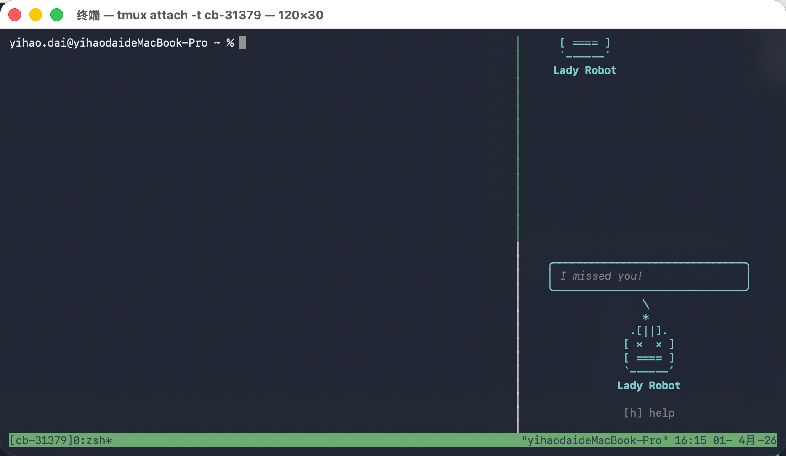

# claude-buddy

[English](README.md) | [中文](README_zh.md)

一个住在你终端里的电子宠物。灵感来自 [Claude Code](https://claude.ai/claude-code) 内置的宠物系统。



## 这是什么？

Claude Code（Anthropic 官方 CLI 工具）内置了一个隐藏的电子宠物系统 —— 一只小小的 ASCII 伙伴，坐在你的输入框旁边，观察你写代码，拥有自己的性格和属性。

**claude-buddy** 将这套宠物系统完整提取并重新实现为独立的终端应用。它运行在 tmux 分屏中，陪伴你的日常开发工作。

## 特性

### 18 种宠物

你的宠物由**用户名哈希确定性生成** —— 每个人都有独一无二的宠物。

```
  鸭子 Duck     鹅 Goose      果冻 Blob      猫 Cat        龙 Dragon     章鱼 Octopus
  <(· )___      (·>           (··)          =·ω·=         <·~·>         ~(··)~

  猫头鹰 Owl    企鹅 Penguin   乌龟 Turtle   蜗牛 Snail     幽灵 Ghost    六角恐龙 Axolotl

  水豚 Capybara 仙人掌 Cactus  机器人 Robot   兔子 Rabbit   蘑菇 Mushroom  胖墩 Chonk
```

### 5 个稀有度

| 稀有度 | 概率 | 星级 | 属性下限 | 有帽子？ |
|--------|------|------|----------|----------|
| 普通 Common | 60% | ★ | 5 | 无 |
| 优秀 Uncommon | 25% | ★★ | 15 | 有 |
| 稀有 Rare | 10% | ★★★ | 25 | 有 |
| 史诗 Epic | 4% | ★★★★ | 35 | 有 |
| 传说 Legendary | 1% | ★★★★★ | 50 | 有 |

另外还有 **1% 的闪光概率**。

### 8 种帽子

非普通宠物会随机获得一顶帽子：皇冠、高帽、螺旋桨、光环、巫师帽、毛线帽、小鸭子帽。

### 5 项属性

每只宠物有一个**峰值属性**和一个**低谷属性**，其余随机分布。属性会影响宠物的"性格"：

| 属性 | 影响 |
|------|------|
| **DEBUGGING** 调试 | 编程建议的质量 |
| **PATIENCE** 耐心 | 鼓励性消息的频率 |
| **CHAOS** 混乱 | 搞怪台词的概率 |
| **WISDOM** 智慧 | 深度编程洞见 |
| **SNARK** 毒舌 | 吐槽和阴阳怪气的频率 |

### 外观进化

每个形态会在精灵上叠加装饰效果：

| 形态 | 等级 | 视觉效果 |
|------|------|---------|
| 幼年 Baby | 1-4 | 基础精灵 |
| 少年 Teen | 5-9 | 闪烁点缀 |
| 成年 Adult | 10-14 | 侧边发光标记 `>...<` |
| 精英 Elite | 15-19 | 侧边装饰 `»...«` + 底部点缀 |
| 传说 Legend | 20 | 金色渲染 + `✦` 边框 |

### 动画系统

- **待机循环** —— 15 帧序列，500ms/帧（~7.5 秒一个循环）：大部分时间静止，偶尔动一动，偶尔眨眼
- **摸头** —— 5 帧爱心飘浮动画（持续 2.5 秒）
- **说话** —— 气泡对话框，自动换行，显示 10 秒，最后 3 秒渐隐
- **睡觉**（5 级+）—— zzZ 飘浮 + 闭眼，60 秒无互动后触发
- **跳舞**（15 级+）—— 摸头时左右摇摆弹跳

### 成长系统（20 级）

你的宠物会随着使用积累经验值并升级：

| 经验来源 | 数值 | 限制 |
|----------|------|------|
| 每日登录 | +10 XP | 每天 1 次 |
| 摸头 | +2 XP | 每天上限 20 XP |
| 查看属性 | +1 XP | 每天上限 5 XP |
| git commit | +5 XP | 无上限 |
| 终端命令 | +1 XP | 每 10 条命令 |
| 连续登录 | +5 × 天数 | 断签重置 |

**里程碑解锁：**

| 等级 | 奖励 |
|------|------|
| 5 | 少年形态 + 睡觉动画 |
| 10 | 成年形态 + 3 顶新帽子 + 新语录包 |
| 15 | 精英形态 + 跳舞动画 + 3 顶新帽子 |
| 20 | 传说形态（发光边框）+ 全部内容解锁 |

属性随等级成长 —— 里程碑等级全属性 +5/+10/+15/+20，峰值属性每偶数级额外 +2。

### 语录系统

宠物每隔 30-120 秒随机说一句话，内容根据性格属性加权：

```
  ┌──────────────────────────────────┐
  │ "过早优化是万恶之源。"              │
  ╰──────────────────────────────────╯
```

毒舌值高的宠物更爱吐槽，智慧值高的宠物爱分享编程技巧，耐心值高的宠物更会鼓励你。

## 安装

### 前置要求

- **Node.js** >= 18
- **tmux**

```bash
# 安装 tmux
brew install tmux      # macOS
sudo apt install tmux  # Ubuntu/Debian
```

### 快速开始

```bash
# 克隆并构建
git clone https://github.com/bigsheeper/claude-buddy.git
cd claude-buddy
npm install
npm run build

# 安装自启动（写入 ~/.zshrc，只需执行一次）
node dist/cli.js install
```

搞定。打开一个新终端，你的宠物就在那里了。

每个新终端窗口会自动进入 tmux，右侧分出一个 20 列的宠物面板。每个终端是独立的 session，全新开始，不会残留历史。

### 卸载

```bash
node dist/cli.js uninstall   # 从 ~/.zshrc 移除自启动代码
```

## 使用方法

### 命令行（从任意终端）

```bash
claude-buddy pet        # 摸摸你的宠物 (♥)
claude-buddy stats      # 显示/隐藏属性面板
claude-buddy mute       # 开关语录气泡
claude-buddy stop       # 关闭宠物面板
```

### 宠物面板内快捷键

点击宠物面板获得焦点后：

| 按键 | 功能 |
|------|------|
| `p` | 摸头（触发爱心动画） |
| `s` | 显示/隐藏属性卡片 |
| `m` | 开关语录 |
| `h` | 显示/隐藏帮助 |
| `q` | 退出 |

### tmux 小贴士

- **切换面板焦点**：`Ctrl+b` 然后方向键
- **键盘滚动**：`Ctrl+b [` 进入滚动模式，方向键翻页，`q` 退出

## 技术架构

```
claude-buddy/
├── src/
│   ├── cli.ts              # 入口 & tmux 管理
│   ├── main.tsx            # Ink 应用启动
│   ├── companion/
│   │   ├── types.ts        # 物种、稀有度、属性定义
│   │   ├── companion.ts    # 确定性宠物生成（Mulberry32 伪随机）
│   │   └── sprites.ts      # ASCII 精灵帧（18 物种 × 3 帧）
│   ├── ui/
│   │   ├── App.tsx          # 根组件
│   │   ├── CompanionSprite.tsx  # 精灵渲染 + 动画引擎
│   │   ├── SpeechBubble.tsx     # 气泡对话框
│   │   └── StatsCard.tsx        # 属性面板
│   ├── state/
│   │   ├── config.ts       # ~/.claude-buddy/config.json 持久化
│   │   └── state.ts        # 运行时状态管理
│   ├── ipc/
│   │   ├── server.ts       # Unix socket 服务端（宠物面板内）
│   │   └── client.ts       # Socket 客户端（跨面板命令）
│   └── quips/
│       └── index.ts        # 性格加权随机语录引擎
```

### 工作原理

1. **宠物生成是确定性的** —— 用户名通过 Mulberry32 PRNG 哈希生成「骨架」（物种、眼睛、帽子、稀有度、属性值）。同一个用户名永远生成同一只宠物。
2. **灵魂是持久化的** —— 名字和性格首次孵化后存入 `~/.claude-buddy/config.json`。骨架每次读取时重新生成（防止通过修改配置伪造稀有宠物）。
3. **IPC 通信** —— 宠物面板通过 Unix socket（`~/.claude-buddy/buddy.sock`）监听命令，所以在任意终端执行 `claude-buddy pet` 都能摸到它。
4. **Ink 渲染** —— 使用 React 的终端版本 Ink，以 500ms 为周期的 tick 驱动动画。

## 灵感来源

本项目忠实复刻了 [Claude Code](https://claude.ai/claude-code)（Anthropic 出品）中的伙伴系统。原版使用 TypeScript + Ink 构建，嵌入在 Claude Code CLI 中。claude-buddy 将其提取为独立工具，任何人都能使用。

与原版的主要区别：

| | 原版 Claude Code | claude-buddy |
|---|---|---|
| 运行方式 | 嵌入 Claude Code CLI | 独立终端应用 |
| 显示位置 | REPL 输入框旁 | tmux 分屏面板 |
| 宠物反应 | Claude AI 根据对话上下文生成 | 性格加权随机语录 |
| 名字生成 | Claude AI 模型生成 | 随机形容词 + 物种名 |
| 宠物绑定 | Anthropic OAuth 账号 UUID | 系统用户名 |

## 许可证

MIT
